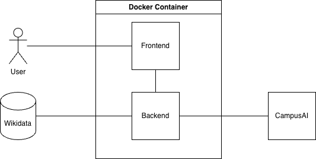
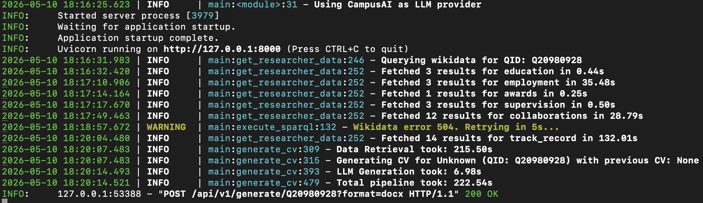
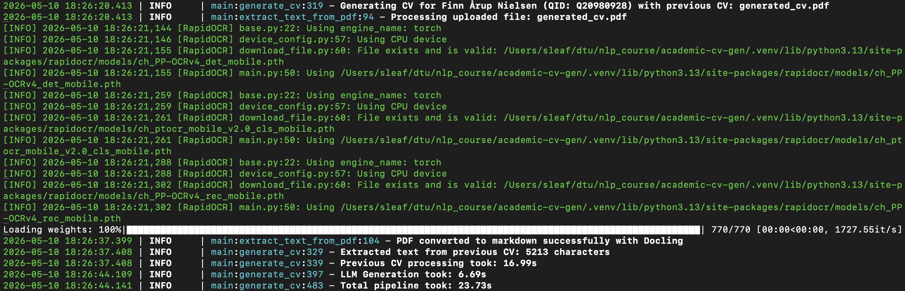

# Academic CV Generator using LLM and Knowledge Graphs
Kenneth Plum Toft - s195171
## Project Description
This project is a Python based web service designed to automate the creation of academic CVs following the Independent Research Fund Denmark (DFF) 2026 guidelines. By integrating Knowledge Graphs (Wikidata) with Large Language Models (Gemma 4), the system ensures that CV data such as education, employment, and awards is grounded in verifiable facts, reducing LLM hallucinations.

The service also supports NLP extraction from existing PDF CVs to incorporate details that might not be present in the wikidata databases.

## System Architecture
The application follows a data processing pipeline:



1.  **Data Layer**: SPARQL queries fetch researcher facts (Name, Education, Employment, Awards, Supervision, Track Record) from Wikidata.
2.  **Processing Layer**: FastAPI handles the logic, including optional PDF text extraction via Docling and template parsing from Word documents.
3.  **Generation Layer**: A prompt containing Wikidata, Optional previous CV PDF text, DFF CV template and DFF instructions is sent to Gemma 4.
4.  **Export Layer**: The resulting text is rendered into `.docx`, `.pdf`, `.md`, or `.tex` formats.


## Tools and Technologies
- NLP & LLM: Gemma4 accessed via the DTU CampusAI (or locally via LM Studio) for text generation.
- Knowledge Graph: Wikidata as the primary data source, queried using SPARQL to retrieve researcher attributes.
- Backend: FastAPI to handle data pipeline, llm orchistration, and file rendering.
- Frontend: Simple streamlit user interface, where you can input QUID for Wikidata query, optional previous CV pdf, choose preferred file format and download the result.
- Environment: Docker for containerization to ensure the service can run anywhere.

## Dataset Description
* **Source**: Dynamic retrieval from **Wikidata** using the SPARQL endpoint.
* **Scope**: Assuming all relevant already exists in Wikidata:
    * **Education (P69)**: Fetches institutions attended, associated degrees, and start/end dates.
    * **Employment (P108)**: Retrieves a history of employers, specific roles or positions held, and the duration of each appointment.
    * **Awards (P166)**: Identifies formal recognition and prizes, including the specific date the award was received.
    * **Academic Supervision**: 
        * **Students (P185)**: Lists individuals for whom the researcher acted as a doctoral or thesis supervisor.
        * **Advisors (P184)**: Identifies the researcher's own academic advisors to establish lineage.
    * **Collaborations**: Lists distinct co-authors (P50) by finding other individuals listed on the same creative works as the researcher.
    * **Track Record (P50)**: Compiles a list of scholarly works authored by the individual, including publication dates.
* **Local Cache**: A pre-queried dataset for Finn Årup Nielsen (`research_Q20980928_results.json`) is included for testing and speed. This dataset will be used if by default skipping the actual Wikidata query if QID Q20980928 is chosen.


## API Description
The service runs in a Docker container and exposes a REST API.

#### 1. POST `/api/v1/generate/{wikidata_qid}`
Generates a formal academic CV based on a Wikidata profile and optional pdf document (previous cv).

**Path Parameters:**
* `wikidata_qid` (string): Unique Wikidata identifier (e.g., `Q20980928`).

**Query Parameters:**
* `format` (string): Output format (`docx`, `pdf`, `markdown`, or `latex`). Defaults to `docx`.

**Request Body**
* `previous_cv` (file, optional): PDF of a previous CV.

**Response:**
* A CV in file of chosen format.

#### 2. POST `/api/v1/research/{wikidata_qid}`
Returns the structured data retrieved from the Wikidata Knowledge Graph.

**Example Output:**
```json
{
  "name": "Finn Årup Nielsen",
  "education": [
    {
      "educationLabel": "Technical University of Denmark",
      "degreeLabel": "Danish PhD",
      "eduStart": "1998-01-01",
      "eduEnd": "2001-01-01"
    },
  ],
  "employment": [...],
  "awards": [...],
  "supervision": [...],
  "collaborations": [...],
  "track_record": [...]
}
```
## CV Structural requirements from DFF (B20)
Using the DFF CV template
- Length: Maximum 3 pages.
- Formatting: Times New Roman, size 12.
  - Margins: At least 2 cm on all sides.
  - Line spacing 1,5.
Content Restriction: No links to external material.
  - No bibliometric indicators other than citations.

#### Mandatory Content Sections
Name
Current Position(s)
Previous Positions
Education
Career Breaks
Research Statement
Personal Context
Grants and Awards
Supervision, teaching and research leadership
Collaborations and teamwork
Contributions to the research community
Contributions to the wider society

## Evaluation and Results
#### Quantitative Evaluation

**API Performance (Latency):** The time it takes to run the full pipeline varies a lot, because the Wikidata SPARQL endpoint is quite unstable, and you often get multiple errors (429, 500, 502, 504). Depending on every try and time of the day changes the speed, or maybe my local IP has been flagged, because i used the endpoint too much. The logs seen in this image is one of the better tries i've had, where only the last query took long to process. The pipeline includes an exponential retry mechanism, which also can contribute to longer query times. (I have seen the collaboration query run in in about 12 seconds).


As better seen in these logs, where i use the hardcoded wikidata results, the total pipeline is quite fast, the llm call only using 7 seconds, extracting text from the previous cv took 17 seconds. So the optimization definitely has to happen in the Wikidata Query. I have tried to optimize the queries, which has helped but due to unstable processing times an external knowledge graph database might be better. Creating a Wikidata dump only including reasearchers to run locally in a graph database, would result in faster and more consistent results.


**SPARQL Results:** It's limited how much testing i have been doing. Mostly been testing with Finns QID (Q20980928) and also Nickis QID (Q57080372) though his wiki page does not include as much information. You can check out the research_Q20980928_results.json file, if you want to see the results for Finns query, it includes information in all the queries.

**LLM Performance:** Once data is retrieved, the generation phase is quite effecient, typically completing in ~7 seconds.

**Compliance Check:** Looking at the generated results (see files in the /generated folder), they seem to follow the specified structural format required by DFF. Though the content itself can be improved, but that is out of the scope of this project.

#### Qualitative Evaluation
The biggest advantage of this system is that it stops the LLM from "making things up." If you ask an AI to write a CV for a researcher, there is a possiblity it guesses their degree dates or invents awards they never won. But in this project we inject actual data from an up-to-date wikidata source.

This can be observed looking at my generated results, because my code sends exact facts from Wikidata (like "Danish PhD, 1998-2001") directly into the prompt, enforcing the LLM to stay truthful. In my tests with Finn Årup Nielsen, the dates and titles in the final CV matched the Knowledge Graph perfectly, which might not have happened with a normal ChatGPT prompt.

#### Merging Old and New Data
I wanted to see how well the LLM could combine the data from Wikidata with a real description from an old CV, but i did not have access to such CV, meaning i cannot comment much on the quality of that result. But the extraction from pdf pipeline worked great using docling.

## Testing
The project includes some unit tests using **pytest** and **pytest-mock** to ensure API reliability and a robust pipeline without actually hitting external endpoints.

#### Test Coverage
* **Health Check**: Verifies service responsiveness at `/health`.
* **Data Mocking**: Simulates Knowledge Graph and LLM responses to verify logic handling.
* **PDF Pipeline**: Tests multipart file uploads and integration with the NLP extraction logic.
* **Error Handling**: Confirms `404` responses for invalid or missing researcher data.

#### Unit Test Execution
Run tests from the root directory:
```bash
python -m pytest -v
```

## LLM Configuration
The API can run against either CampusAI or a local LM Studio server.

Set `LLM_PROVIDER=lmstudio` to use a local model, then configure:
- `LMSTUDIO_BASE_URL=http://localhost:1234/v1`
- `LMSTUDIO_MODEL=<your-local-model-name>`
- `LMSTUDIO_API_KEY=lm-studio` if your local server expects a key

Leave `LLM_PROVIDER` unset, or set it to `campusai`, to use the DTU CampusAI endpoint.

## How to Run (Docker)
The application is containerized to run both the FastAPI backend and Streamlit frontend in a single environment.

1.  **Configure Environment**: Create a `.env` file in the root with your `CAMPUSAI_API_KEY`.
2.  **Build the Image**:
    ```bash
    docker build -t academic-cv-gen .
    ```
3.  **Run the Container**:
    ```bash
    docker run -p 8000:8000 -p 8501:8501 --env-file .env academic-cv-gen
    ```

## How to Run Locally (Without Docker)
1.  **Install Dependencies**: `pip install -r requirements.txt`.
2.  **Start Services**:
    * Backend: `uvicorn main:app`.
    * Frontend: `streamlit run frontend.py`.
3.  **Access**:
    * UI: `http://localhost:8501`.
    * API Docs: `http://localhost:8000/docs`.